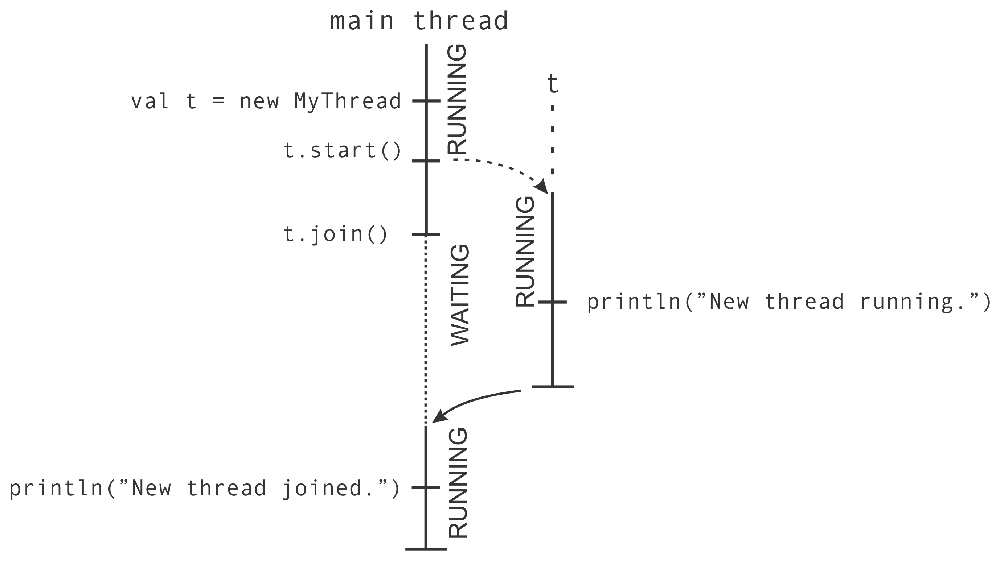
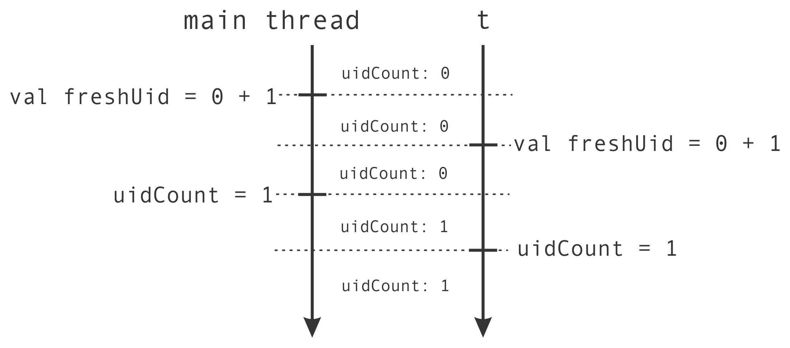
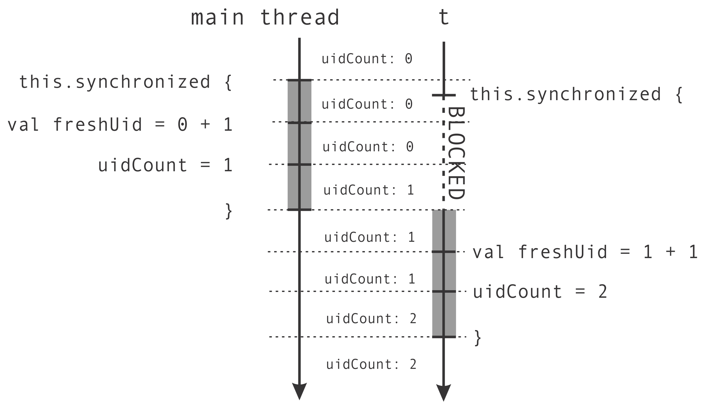

# Parallel and Concurrent programming in Scala

## Threads
Creating threads

This is the main thread, the ones that runs the jvm
```scala
object ThreadsMain extends App {
    val t: Thread = Thread.currentThread
    val name = t.getName
    println(s"I am the thread $name")
}
```

To create a new thread:

```scala
object ThreadsCreation extends App {
    class MyThread extends Thread {
    override def run(): Unit = {
        println("New thread running.")
    }
    }
    val t = new MyThread
    t.start()
    t.join()
    println("New thread joined.")
}
```
The `t.start()` start the new thread along the main thread is created, the `t.join()` method halts the execution of the main thread until t completes its execution. We say that the join operation puts the main thread into the waiting state until t terminates.

> Waiting threads notify the OS that they are waiting for some condition and cease spending CPU cycles, instead of repetitively  checking that condition.



Atomic execution of a block of code means that the individual statements in that
block of code executed by one thread cannot interleave with those statements executed by
another thread.
This can be assured with `synchronized` statement
```scala
def getUniqueId() = this.synchronized {
    val freshUid = uidCount + 1
    uidCount = freshUid
    freshUid
}
```
## Non-Atomic



## Atomic



```scala

```

```scala

```

```scala

```

```scala

```

```scala

```

```scala

```

```scala

```

```scala

```

```scala

```

```scala

```

```scala

```

```scala

```

```scala

```

```scala

```

```scala

```

```scala

```

```scala

```

```scala

```

```scala

```

```scala

```

```scala

```

```scala

```

```scala

```

```scala

```

```scala

```

```scala

```

```scala

```

```scala

```

```scala

```

```scala

```

```scala

```

```scala

```

```scala

```

```scala

```

```scala

```

```scala

```

```scala

```

```scala

```

```scala

```

```scala

```

```scala

```

```scala

```

```scala

```

```scala

```

```scala

```

```scala

```

```scala

```

```scala

```

```scala

```

```scala

```

```scala

```

```scala

```

```scala

```

```scala

```

```scala

```

```scala

```

```scala

```

```scala

```

```scala

```

```scala

```

```scala

```

```scala

```

```scala

```

```scala

```

```scala

```

```scala

```

```scala

```

```scala

```

```scala

```

```scala

```

```scala

```

```scala

```

```scala

```

```scala

```

```scala

```

```scala

```

```scala

```

```scala

```

```scala

```

```scala

```

```scala

```

```scala

```

```scala

```

```scala

```

```scala

```

```scala

```

```scala

```

```scala

```

```scala

```


